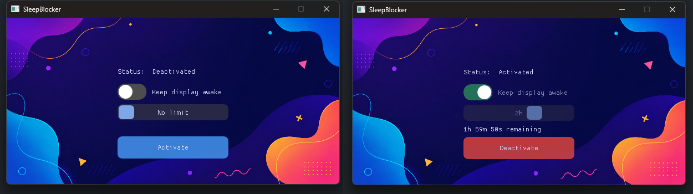

# Sleep Blocker

**Sleep Blocker** is a simple cross-platform desktop app for Windows and Linux, written in C++, that keeps your computer awake by temporarily preventing system sleep using native OS APIs.

## 🔳 Goals

This mini project started as a way to:

* Build a single sleep-blocking app for personal use that works on both Windows and Linux.
* Experiment with the [Dear ImGui](https://github.com/ocornut/imgui) library for building lightweight desktop UIs.
* Explore platform-specific APIs for temporarily preventing system sleep.

## 🔳 Details

### 🔹 GUI
The user interface is built with [Dear ImGui](https://github.com/ocornut/imgui), an immediate-mode GUI library written in C++.

### 🔹 Windowing & Platform Layer
The application supports two interchangeable backends:

- [GLFW](https://www.glfw.org/) — lightweight cross-platform window and input handling.
- [SDL3](https://github.com/libsdl-org/SDL) — cross-platform windowing, input, and platform abstraction.

The backend can be selected at build time.

### 🔹 Rendering
Rendering is performed using OpenGL 3.0 through Dear ImGui's OpenGL backend.

### 🔹 Sleep Prevention Backends

The application uses native operating system APIs to temporarily prevent system sleep:

* #### 🖥️ Windows
  * Uses the Windows power management API (`SetThreadExecutionState`) to prevent the system from sleeping while the blocker is active.

* #### 🐧 Linux
  * Uses `org.freedesktop.login1` (`systemd-logind`) through D-Bus to request a sleep inhibitor, temporarily preventing system suspend while the blocker is active.